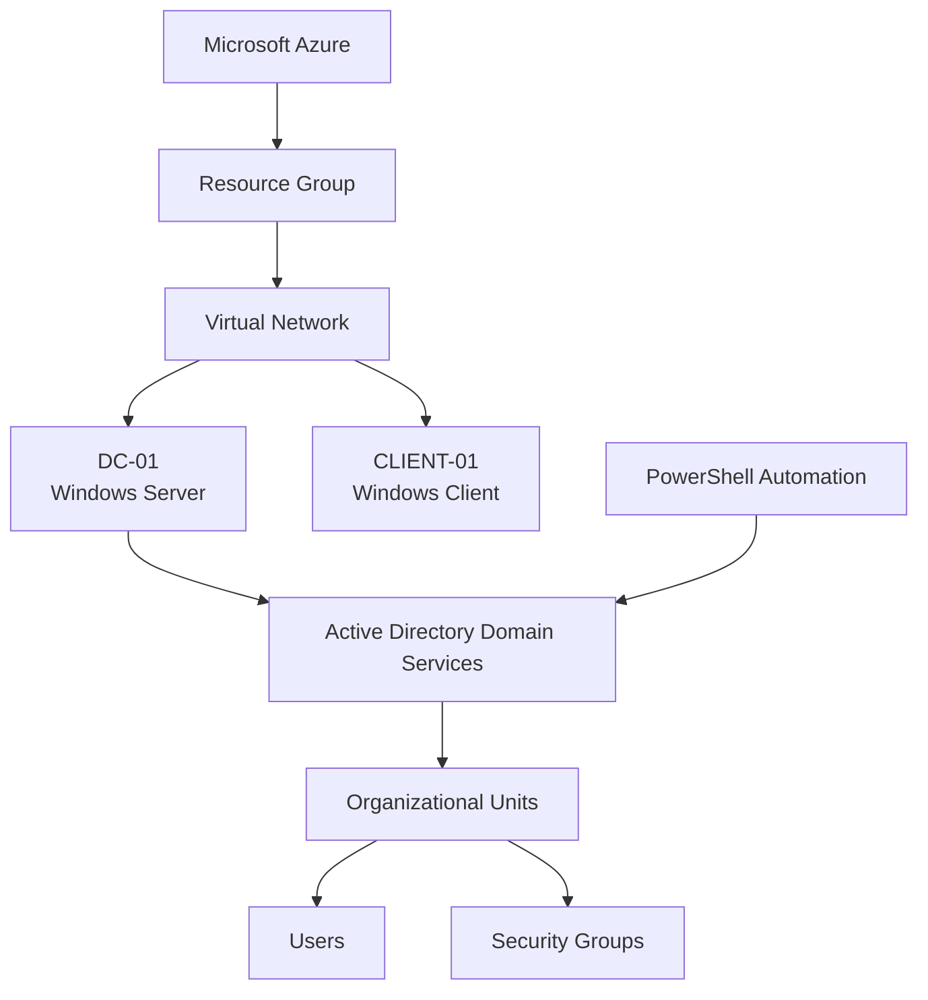

# Azure Active Directory Home Lab

## Overview

This project demonstrates the deployment, administration, and automation of an enterprise-style Active Directory environment hosted in Microsoft Azure.

The goal of this project is to simulate the responsibilities of a Cloud Engineer, Systems Administrator, or IT Administrator by building and managing a production-like Windows Server environment while automating common administrative tasks using PowerShell.

---

## Architecture



---

## Technologies Used

- Microsoft Azure
- Terraform
- Infrastructure as Code (IaC)
- Windows Server 2022
- Windows 11
- Active Directory Domain Services (AD DS)
- DNS
- PowerShell
- SMB File Sharing
- Git
- GitHub
- Visual Studio Code

---

## Features Implemented

### Azure Infrastructure & Terraform

- Provisioned and managed Azure infrastructure using Terraform
- Configured Azure Resource Group
- Configured Virtual Network and Subnet
- Configured Network Security Groups (NSGs)
- Configured Public IP addresses and Network Interfaces
- Deployed Windows Server Domain Controller (`DC-01`)
- Deployed Windows 11 client (`CLIENT-01`)
- Configured DC-01 with static private IP `10.0.0.4`
- Configured the virtual network to use DC-01 for DNS
- Managed existing Azure resources using Terraform state and resource imports
- Destroyed and successfully rebuilt the Azure environment from Infrastructure as Code

### Active Directory
- Installed Active Directory Domain Services (AD DS)
- Promoted the server to a Domain Controller
- Created the `corp.local` domain
- Designed Organizational Unit (OU) structure
- Created and managed user accounts
- Created department-based security groups
- Verified Active Directory configuration using PowerShell

### PowerShell Automation
- Imported employee data from CSV
- Automated Active Directory user provisioning
- Automated Organizational Unit assignment
- Automated security group assignment
- Dynamic username generation
- Duplicate user detection
- Logging and error handling

---

## Build Walkthrough

### 1. Azure Infrastructure

#### Resource Group


Created a dedicated Azure Resource Group (`rg-ad-lab`) to organize all Azure resources associated with the Active Directory environment, including virtual machines, networking, storage, and security resources.

---

#### Virtual Network


Configured an Azure Virtual Network (`DC-01-vnet`) with an address space of `10.0.0.0/16` to enable secure communication between virtual machines. The Domain Controller was configured as the DNS server for the network.

---

#### Domain Controller Virtual Machine


Deployed a Windows Server virtual machine (`DC-01`) that serves as the Domain Controller for the `corp.local` Active Directory domain.

---

### 2. Terraform Infrastructure as Code

After initially building the Azure environment, I converted the underlying infrastructure to Terraform to make the lab reproducible and manageable as Infrastructure as Code (IaC).

Terraform manages the core Azure infrastructure, including:

- Resource Group
- Virtual Network
- Subnet
- Network Security Groups
- Public IP addresses
- Network Interfaces
- DC-01 Windows Server VM
- CLIENT-01 Windows 11 VM
- Static private IP configuration for DC-01
- DNS configuration

The infrastructure was managed using the standard Terraform workflow:

```bash
terraform init
terraform fmt
terraform validate
terraform plan
terraform apply
```

Existing Azure resources were imported into Terraform state while converting the original manually deployed environment to Infrastructure as Code.

After completing the Terraform configuration, I destroyed and reprovisioned the Azure infrastructure to verify that the environment could be recreated from code.

During the rebuild, I troubleshot Azure networking and Terraform state issues, including importing an existing Azure resource into Terraform state after an Azure operation partially completed.

This demonstrated the ability to manage the infrastructure lifecycle using Terraform rather than relying only on manual Azure Portal configuration.

---
---

### 3. Active Directory Configuration

#### Domain Controller Verification


Verified that the server was successfully promoted to a Domain Controller by confirming the Active Directory domain configuration using PowerShell.

---

#### Organizational Units


Created Organizational Units (OUs) for IT, HR, Finance, Sales, Servers, and Workstations to organize users and computers according to departmental structure.

---

#### User Accounts


Created and verified Active Directory user accounts for multiple departments within the `corp.local` domain.

---

#### Security Groups


Configured department-based security groups to support role-based access control (RBAC) and simplify permission management.

---

### 4. PowerShell Automation

#### User Provisioning Script


Developed a PowerShell automation script that imports employee information from a CSV file, generates usernames, creates Active Directory user accounts, assigns each user to the correct Organizational Unit, adds them to the appropriate security group, and records all actions in a log file.

---

### 5. Client Domain Join & Authentication Validation

After configuring Active Directory, CLIENT-01 was configured to use the Domain Controller at `10.0.0.4` as its DNS server and joined to the `corp.local` domain.

DNS connectivity between CLIENT-01 and DC-01 was verified before performing the domain join.

The domain trust relationship was validated using PowerShell:

```powershell
Test-ComputerSecureChannel
```

The command returned:

```text
True
```

confirming that CLIENT-01 maintained a valid secure channel with the `corp.local` domain.

Finally, a provisioned Active Directory user successfully authenticated to CLIENT-01.

```powershell
whoami
# corp\jsmith

$env:USERDOMAIN
# CORP

$env:USERNAME
# jsmith
```


This validated the complete deployment workflow:

**Terraform → Azure Infrastructure → PowerShell Automation → Active Directory → Domain Join → Domain User Authentication**


---

#### Script Execution


Executed the provisioning script to automatically create new users, assign security groups, and place users into their corresponding Organizational Units.

---

#### Logging


Implemented logging to record provisioning activity, successful account creation, and duplicate-user detection for auditing and troubleshooting.

---

#### Group Membership Validation


Verified that newly created users were automatically assigned to the appropriate department security groups using PowerShell.

---
## Project Outcomes

Successfully deployed, automated, destroyed, rebuilt, and validated an enterprise-style Active Directory environment in Microsoft Azure.

Implemented:

- Azure infrastructure provisioning with Terraform
- Infrastructure as Code (IaC)
- Azure Virtual Network and Subnet
- Network Security Groups
- Windows Server Domain Controller
- Windows 11 domain client
- Active Directory Domain Services
- `corp.local` domain
- DNS configuration
- Organizational Units
- Department-based Security Groups
- CSV-based user provisioning with PowerShell
- Automated security group assignment
- Department SMB file shares
- Client domain join
- Active Directory domain authentication
- Terraform state management and resource importing

---

## Project Structure

```text
Azure-AD-Lab
│
├── Documentation
├── Screenshots
├── Scripts
│   ├── CreateUsers.ps1
│   ├── ResetPasswords.ps1
│   ├── DisableInactiveUsers.ps1
│   ├── UserReport.ps1
│
└── README.md
```

---

## Skills Demonstrated

- Microsoft Azure Administration
- Terraform
- Infrastructure as Code (IaC)
- Terraform State Management
- Azure Virtual Networking
- Network Security Groups
- Windows Server Administration
- Active Directory Domain Services
- DNS Configuration
- Domain Join & Authentication
- PowerShell Scripting
- Automated User Provisioning
- SMB File Sharing
- Infrastructure Troubleshooting
- Git Version Control
- GitHub

---

## Current Progress

- ✅ Azure Infrastructure
- ✅ Domain Controller Deployment
- ✅ Active Directory Installation
- ✅ DNS Configuration
- ✅ Organizational Units
- ✅ Users & Groups
- ✅ PowerShell User Provisioning
- ✅ Automatic OU Assignment
- ✅ Automatic Security Group Assignment
- ✅ Duplicate User Detection
- ✅ Logging
- ✅ Error Handling

---

## Future Improvements

- Password Reset Automation
- Disable Inactive Accounts
- Account Unlock Automation
- User Reporting Dashboard
- Azure Monitor Integration
- Azure Backup
- Azure Update Manager
- Azure Bastion

---

## Author

**Raheem**

Computer Science Student | George Mason University

Building cloud engineering, systems administration, and infrastructure automation projects using Azure, PowerShell, Git, and Windows Server.
